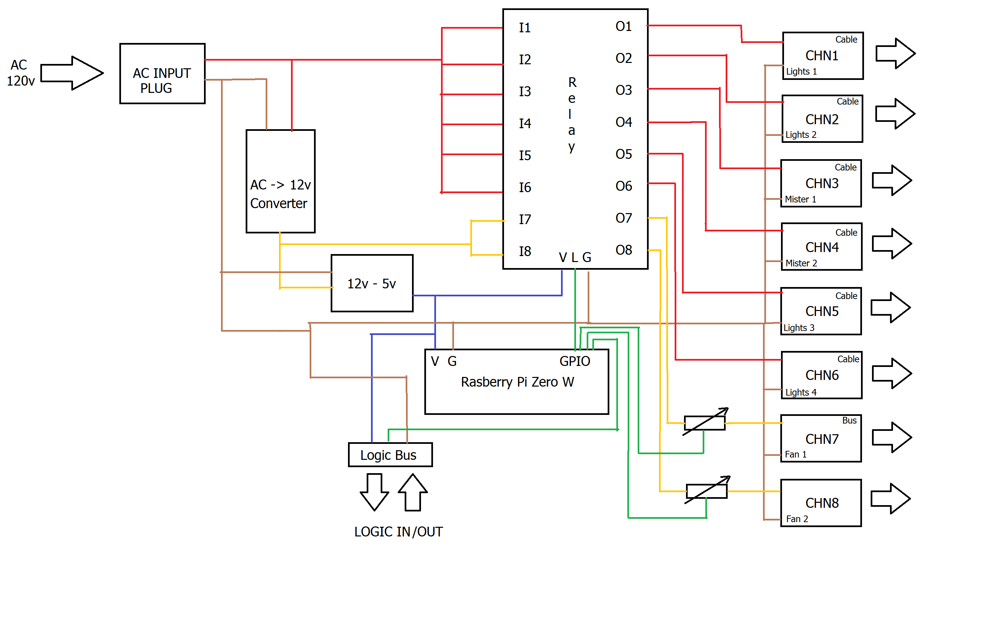

## Request
Two cages, with misters, lights and fans, all running off 120V AC power. All devices need to be controlled by a single controller. Devices will need to be turned on/off at reprogrammable times of day, with multiple on/off times per device. Programs need to be programmable down to 1-sec intervals. Will need to track time of day, so that programs run at the same times. Need to be able to have different programs for all devices, and every day of the week. Need to be able to measure humidity and use the humidity to control the fans, based on a user set threshold. want the ability to recover from power loss and update time of day and put lights back into the state they were prior to power loss. Misters should ALWAYS start in the OFF state after power loss and NOT return to on, if they were running when power goes out. Would like a webpage to set the config file if possible, but need a way to modify programs as applicable. would be nice if RTC autochanged with daylight savings time and autosynced to remove clock drift. electric power needs to be in a box that protects any circuitry from being contacted inadvertantly
### Device channels (by cage)
2 lights \
1 mister \
1 fan

## Description of block diagram

System has one AC input and one input on the logic bus. Has six AC channel outputs, which will vary in size depending on requirement, as well as two 12v outputs and 1 logic bus for humidity sensing. \
AC POWER: AC power is received externally from the female AC plug. AC power is split amongst the six channels output and one branch to a 120vAC to 12vDC converter. \
12v DC POWER: 12vDC power is output from the converter and split into the two 12v channels, as well as a branch for the 12vDC to 5vDC converter. \
5v DC POWER: 5vDC is output from the converter and used to power the logic element of the relay, the Rpi Zero, and the digital potentiometers, as well as being an ouput on the logic bus to power the humidity sensors.

## Purchasing List:
Current list is being narrowed down through amazon, link here:\
https://www.amazon.com/hz/wishlist/ls/33Y2IXWOOTIRV/ref=nav_wishlist_lists_3

## Software Heirarchy
Interface.py - head of system daemon \
config/ - contains settings for channels \
html/ - contains html for web interface \
css/ - support for index.html \
[process?] - possible .py for subprocess
