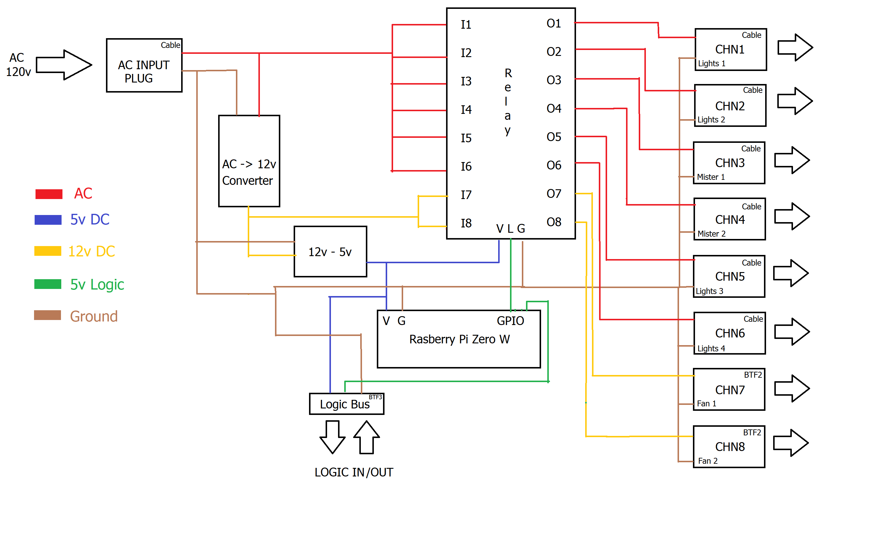

## Project Overview
### Original Request
"Two cages, with misters, lights and fans, all running off 120V AC power. All devices need to be controlled by a single controller. Devices will need to be turned on/off at reprogrammable times of day, with multiple on/off times per device. Programs need to be programmable down to 1-sec intervals. Will need to track time of day, so that programs run at the same times. Need to be able to have different programs for all devices, and every day of the week. Need to be able to measure humidity and use the humidity to control the fans, based on a user set threshold. want the ability to recover from power loss and update time of day and put lights back into the state they were prior to power loss. Misters should ALWAYS start in the OFF state after power loss and NOT return to on, if they were running when power goes out. Would like a webpage to set the config file if possible, but need a way to modify programs as applicable. would be nice if RTC autochanged with daylight savings time and autosynced to remove clock drift. electric power needs to be in a box that protects any circuitry from being contacted inadvertantly."
### Device channels (by cage)
2 lights \
1 mister \
1 fan

## Electrical block diagram

System has one AC input and one input on the logic bus. Has six AC channel outputs, which will vary in size depending on requirement, as well as two 12v outputs and 1 logic bus for humidity sensing. \
**AC POWER:** AC power is received externally from the female AC plug. AC power is split amongst the six channels output and one branch to a 120vAC to 12vDC converter. \
**12v DC POWER:** 12vDC power is output from the converter and split into the two 12v channels, as well as a branch for the 12vDC to 5vDC converter. \
**5v DC POWER:** 5vDC is output from the converter and used to power the logic element of the relay, the Rpi Zero, and the digital potentiometers, as well as being an ouput on the logic bus to power the humidity sensors.

## Mechanical Design
Hopefully this will all be able to fit in a relatively small box. I would like to get it 3D printed, and so I will try to compact everything such that it will fit within the bounds of a printer. The box itself can be very simple, and from there I just add some holes for the various inputs and outputs, as well as a removable lid of some sort. Will post 3d sketchs when parts list is more narrowed down.

## Purchasing List:
Current list is being narrowed down through amazon, link here: \
https://www.amazon.com/hz/wishlist/ls/33Y2IXWOOTIRV/ref=nav_wishlist_lists_3
### Items
*(Status of items is either Waiting, Conflict, Approved, Purchased)* \
- **Rasberry Pi Zero W**: the brains. *Approved*
- **AZDelivery Humidity Sensor**: measures humidity in the cages to control fan speed. *Waiting*
- **12v Power Supply**: takes AC power and converts for the fans and logical systems. *Waiting*
- **12v to 5v Converter**: down-converts the 12V line for Rpi and humidity sensors. *Waiting*
- **Sunfounder 8 Chn Relay**: Takes in AC or DC power and acts as a digitally controlled switch. *Waiting*
- **GearIT 16 Gauge Wire**: Used on the AC systems for safety. *Waiting*
- **20 Gauge 3 conductor wire**: Used to connect the fans and the humidity sensors, since it provides ample weather protection from wet environments. *Waiting*
- **20 Gauge standard wire**: Used internally to connect elements. *Waiting*
- **3Dman 15 Rocker**: Used as system input, has a 5A fuse and a rocker switch. Fuse can be swapped for 10A if necessary. *Waiting*
- **Panel mount AC outlets**: Used as the channel outputs for the 6 AC channels. Positive from the relays, neutral and ground go to the rocker input. *Waiting*
- **BTF-Lightning connectors**: Used as the connections for the 2 fan channels and the connections to the humidity sensors in combination with the 3 conductor wire. *Waiting*
- **Standoffs, Plastic Feet, Suction Cups**: Mechanical. Standoffs for circuitry, plastic feet for the mechanical housing (TBD), and suction cups for the humidity sensors to stick to the glass and stay in place. *Waiting*
- Need some type of digital pot for the fan speed? Must operate at 12v? it may not work with the logic and the power being at different levels. Perhaps another method is needed.

## Software Design
### Goal
using the interface, user should be able to open the ip address on local network and configure an Rpi Zero via browser. The JS elements in the background of the HTML send requests that the python script running at the other end can pick up and identify which element that the user has interacted with. From there, the python "interface" can interact with the GPIO pins on the RPI to control the relay. There will also be a "subconcious" measurement of the humidity in the system, which will vary the fan speed accordingly. Rpi will be able to send a signal to the digital potentiometer controlling the speed. User can turn fan speed on and off manually through the website, otherwise the values are just controlled by the sensors. The interface python script will run as a daemon so that in the event of a powerloss, the system will come back online in case of a failure. Should there be trouble, user can SSH into Rpi for support. The changing of the config files can be done by SSHing into the Rpi and using the built in python script in the config folder, which will open and rewrite the config files for you.
### Heirarchy Goal
Interface.py - head of system daemon \
config/ - contains settings for channels \
html/ - contains html for web interface \
html/css/ - support for index.html \
